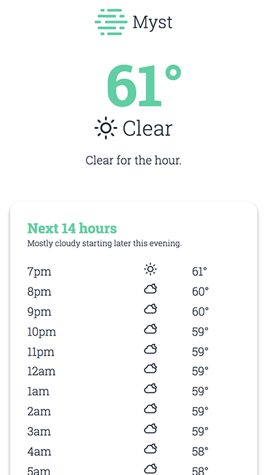

# Myst (WIP)



[Myst](https://myst.stomprocket.io) is a beautiful, lightweight, open source weather app PWA developed by [Ronan Furuta](https://ronanfuruta.com) @ [Stomp Rocket](https://stomprocket.io).

> Currently Myst only supports mobile phones. Support for desktop and tablets in the future is planned.

## Features

- Current weather, description (sunny), and summary (Mostly cloudy starting later this evening)
- Weekly weather information
  ** high and low
  ** description
  \*\* summary
- Next 14 hours weather info

## Roadmap

- Desktop and tablet support
- ~~Cleaner offline/no location warnings~~
- Upcomming rain information
- Sunset and sunrise time
- Animations
- Geolocation API fallback
- Morning notifications about the days weather
- Settings screen with theme options
- Faster startup (maybe native app)
- Start screen images
- ~~Hourly forcast~~

## Development

```bash
npm install

npm run serve #dev server

npm run build #build for production

npm run release #builds and deploys to firebase
```

## License

Apache License 2.0
